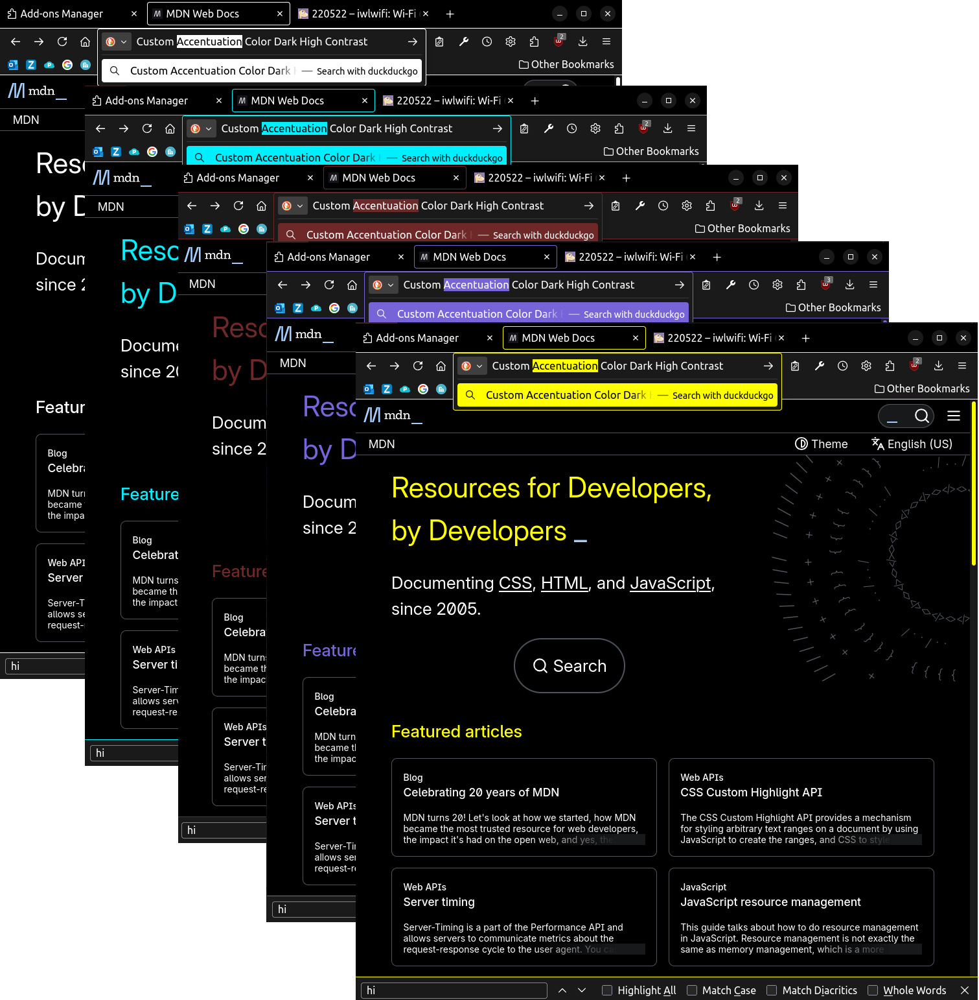
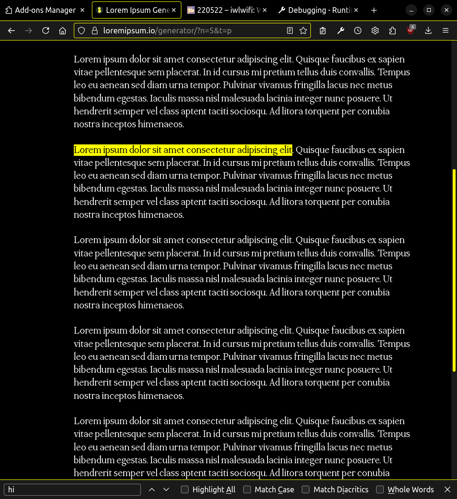
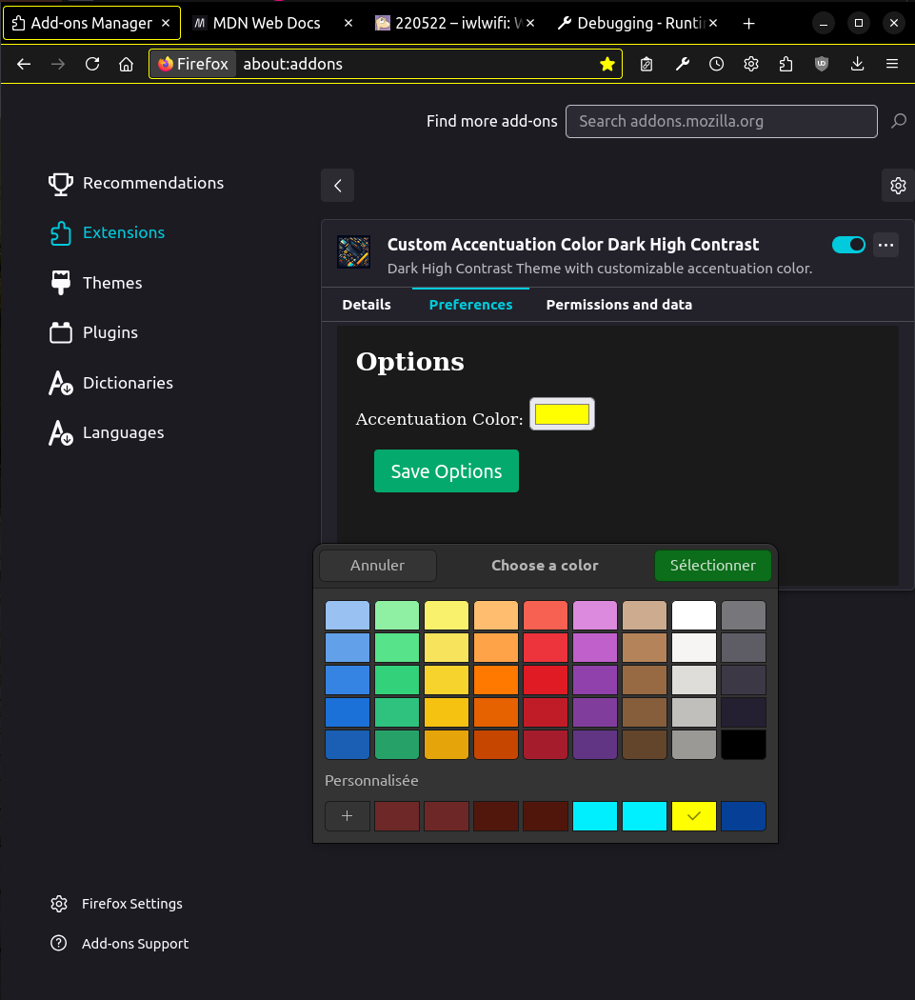

# Custom Accentuation Color Dark High Contrast

  

This firefox extension is a Dark High Contrast theme with the ability to customize the main accentuation color.
It is very similar to [this theme](https://github.com/JayBeeDe/vscode_extensions/tree/master/cacdhc) for vscode.

    

You can choose the custom accentuation color that you like.

It also propagates the dark high contrast them to the web page you are visiting (if compatible).

The accentuation color can be changed in the extension page:

