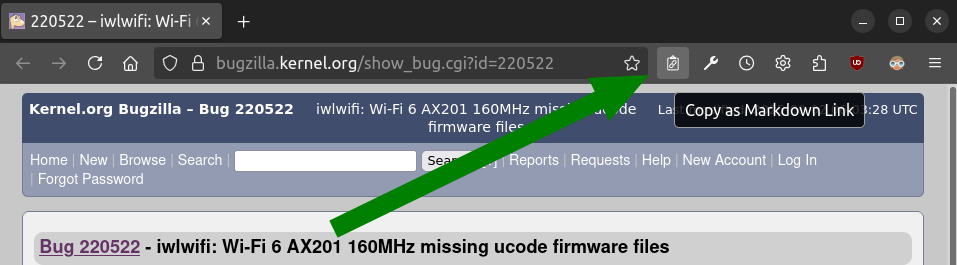

# copy-as-markdown-link

<p align="center">
  
</p>

Firefox Extension to copy the current tab's URL and title as a Markdown/Jira/HTML link to the clipboard.

<p align="center">
    <a href="https://addons.mozilla.org/firefox/addon/copy-as-markdown-link/">
        
    </a>
</p>

For example, suppose your active tab is <https://bugzilla.kernel.org/show_bug.cgi?id=220522>.

Trigger the extension action either by clicking the  icon in the Firefox toolbar or by using the extension shortcut configured near "Copy the current tab's URL and title as Markdown link" (default is `Ctrl+Alt+M`).



The title of the page is "220522 – iwlwifi: Wi-Fi 6 AX201 160MHz missing ucode firmware files"
So the markdown link copied to your clipboard is:

```markdown
[220522 – iwlwifi: Wi-Fi 6 AX201 160MHz missing ucode firmware files](https://bugzilla.kernel.org/show_bug.cgi?id=220522)
```

Which outputs: [220522 – iwlwifi: Wi-Fi 6 AX201 160MHz missing ucode firmware files](https://bugzilla.kernel.org/show_bug.cgi?id=220522).

Now let's suppose you are often working on this website and you want to simplify the link title. Suppose you want something like:

```markdown
[#220522](https://bugzilla.kernel.org/show_bug.cgi?id=220522)
```

Which outputs: [#220522](https://bugzilla.kernel.org/show_bug.cgi?id=220522).

To do that, open the extension preferences page and add the following rule:

- URL Match Pattern: `https://bugzilla\.kernel\.org/show_bug\.cgi.*`
- Title Match Pattern: `(\d+)( – .+)`
- Title Replacement: `#$1`


Do not forget to click "Save Options" button and go back to the <https://bugzilla.kernel.org/show_bug.cgi?id=220522> page.
Trigger the extension action.

Please note that there are also keyboard shortcuts to copy links in Jira and HTML formats, which include the link's title similarly to Markdown syntax.


With our previous example, it will result as follow:

- For Jira syntax: default keyboard shortcut is `Ctrl+Alt+J`:

```none
[#220522|https://bugzilla.kernel.org/show_bug.cgi?id=220522]
```

- For HTML syntax: default keyboard shortcut is `Ctrl+Alt+H`:

```html
<a href="https://bugzilla.kernel.org/show_bug.cgi?id=220522" title="#220522" target="_new">#220522</a>
```
